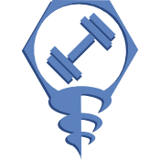

# Drill

## Overview

Drill is a fitness dApp we built at AngelHack Manhattan that promotes Body-weight exercises and peer to peer learning over expensive Gym memberships and personal trainers.

## Installation

dependecies include 

cd to db/ 

# Try it!

Take a look at our Beta web app [HERE!](http://www..com/)

